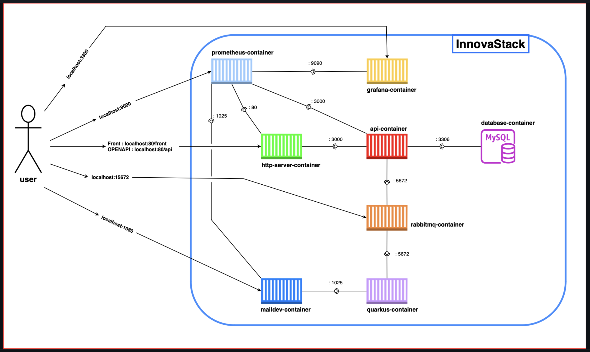
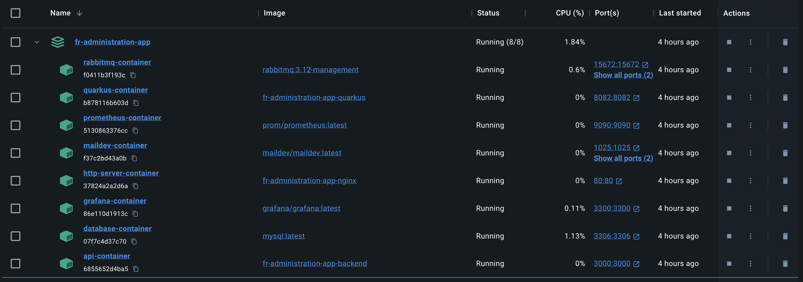
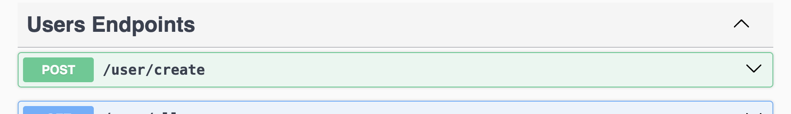

# Architecture.md

## Table des Matières

- [Architecture.md](#architecturemd)
  - [Table des Matières](#table-des-matières)
  - [1. Introduction](#1-introduction)
  - [2. Vue d'ensemble de l'architecture](#2-vue-densemble-de-larchitecture)
    - [2.1. Interactions Utilisateur](#21-interactions-utilisateur)
    - [2.2. Composants du Système](#22-composants-du-système)
      - [2.2.1. http-server-container](#221-http-server-container)
      - [2.2.2. api-container](#222-api-container)
      - [2.2.3. rabbitmq-container](#223-rabbitmq-container)
      - [2.2.4. quarkus-container](#224-quarkus-container)
      - [2.2.5. maildev-container](#225-maildev-container)
      - [2.2.6. prometheus-container](#226-prometheus-container)
      - [2.2.7. grafana-container](#227-grafana-container)
      - [2.2.8. database-container](#228-database-container)
    - [2.3. Communication et Ports](#23-communication-et-ports)
  - [3. Description détaillée des services](#3-description-détaillée-des-services)
    - [3.1. http-server-container (Nginx)](#31-http-server-container-nginx)
    - [3.2. api-container (Node.js)](#32-api-container-nodejs)
    - [3.3. rabbitmq-container (RabbitMQ)](#33-rabbitmq-container-rabbitmq)
    - [3.4. quarkus-container (Quarkus)](#34-quarkus-container-quarkus)
    - [3.5. maildev-container (MailDev)](#35-maildev-container-maildev)
    - [3.6. prometheus-container (Prometheus)](#36-prometheus-container-prometheus)
    - [3.7. grafana-container (Grafana)](#37-grafana-container-grafana)
    - [3.8. database-container (MySQL)](#38-database-container-mysql)
  - [4. Sécurité](#4-sécurité)
    - [4.1. Communication Sécurisée](#41-communication-sécurisée)
    - [4.2. Sécurité au Niveau du Réseau](#42-sécurité-au-niveau-du-réseau)
    - [4.3. Authentification et Autorisation](#43-authentification-et-autorisation)
    - [4.4. Sécurité des Données](#44-sécurité-des-données)
    - [4.5. Surveillance et Réponse aux Incidents](#45-surveillance-et-réponse-aux-incidents)
  - [5. Configuration et déploiement](#5-configuration-et-déploiement)
    - [5.1. Docker et Docker Compose](#51-docker-et-docker-compose)
    - [5.2. Processus de déploiement](#52-processus-de-déploiement)
    - [5.3. Gestion de la Configuration](#53-gestion-de-la-configuration)
    - [5.4. Sécurité du déploiement](#54-sécurité-du-déploiement)
    - [5.5. Surveillance de l'Infrastructure](#55-surveillance-de-linfrastructure)
  - [6. Utilisation](#6-utilisation)
    - [6.1. Démarrage de l'Application](#61-démarrage-de-lapplication)
    - [6.2. Lancement de l'Application](#62-lancement-de-lapplication)
    - [6.2. En cas d'erreur lors de la création du 1er utilisateur à l'aide de l'OpenAPI (Swagger)](#62-en-cas-derreur-lors-de-la-création-du-1er-utilisateur-à-laide-de-lopenapi-swagger)
  - [7. Maintenance et surveillance](#7-maintenance-et-surveillance)
    - [7.1. Stratégies de Maintenance](#71-stratégies-de-maintenance)
    - [7.2. Outils de Surveillance](#72-outils-de-surveillance)
    - [7.3. Logging](#73-logging)
    - [7.4. Alerting et Notification](#74-alerting-et-notification)
  - [8. Fonctionnalités supplémentaires](#8-fonctionnalités-supplémentaires)
    - [8.1. Interface Utilisateur Intuitive](#81-interface-utilisateur-intuitive)
    - [8.2. Intégration et Extensibilité](#82-intégration-et-extensibilité)
    - [8.3. Observabilité](#83-observabilité)
    - [8.4. Sécurité Renforcée](#84-sécurité-renforcée)
    - [8.5. Support de la Communauté](#85-support-de-la-communauté)
    - [8.6. Automatisation et CI/CD](#86-automatisation-et-cicd)
    - [8.7. Conformité et Standards](#87-conformité-et-standards)
  - [9. Conclusion](#9-conclusion)
  - [10. Annexe](#10-annexe)

## 1. Introduction

Bienvenue dans le document architectural d'`InnovaStack`, un projet conçu pour encapsuler l'avant-garde des technologies de microservices dans un écosystème interopérable et évolutif. Le nom InnovaStack est dérivé de notre aspiration à innover constamment dans l'empilement des technologies — chaque couche ajoutée vise à renforcer et à étendre les capacités de l'ensemble du système.

Ce projet est né de la nécessité de créer une architecture qui n'est pas seulement robuste et fiable mais aussi adaptative, capable de s'ajuster et de s'étendre en fonction des besoins émergents des entreprises modernes. Dans un monde où la vitesse de livraison et la flexibilité sont primordiales, InnovaStack se positionne comme un catalyseur de développement rapide et de déploiement continu.

Le choix d'une `architecture de microservices` n'est pas anodin. Il s'agit d'une décision délibérée pour embrasser la complexité du domaine d'application tout en maintenant la simplicité dans la maintenance et l'évolutivité. Chaque microservice dans InnovaStack est conçu pour fonctionner comme une entité autonome, avec sa propre base de code, sa base de données et ses dépendances, le tout orchestré dans une harmonie qui favorise la résilience et la redondance.

Ce document vise à décrire de manière exhaustive l'architecture d'InnovaStack. Il servira de guide pour d'utilisation. Il est organisé en sections détaillant chaque composant du système, des services backend et frontaux aux outils de surveillance et de visualisation. À travers ce document, nous espérons non seulement informer mais aussi inspirer l'adoption et l'adaptation de nos méthodes et de notre architecture.

Dans les pages qui suivent, vous découvrirez non seulement les choix technologiques et architecturaux qui sous-tendent InnovaStack, mais aussi les philosophies et les stratégies qui nous motivent à innover continuellement et à pousser les limites de ce qui est possible avec les microservices.

## 2. Vue d'ensemble de l'architecture

InnovaStack est conçu autour d'une architecture orientée microservices, où chaque composant joue un rôle spécifique au sein d'une infrastructure distribuée. Cette architecture est structurée pour favoriser la scalabilité, la résilience et la souplesse dans le développement et le déploiement de nos services.



### 2.1. Interactions Utilisateur

Les utilisateurs interagissent avec notre système à travers une interface de frontend accessible via `localhost:80/front` et une API à `localhost:80/api`. Ces points d'entrée sont exposés par un serveur HTTP Nginx qui sert à la fois de reverse proxy et de serveur de contenu statique.

### 2.2. Composants du Système

#### 2.2.1. http-server-container

Le `http-server-container` est notre porte d'entrée principale. Hébergeant un serveur Nginx, il est configuré pour diriger les requêtes entrantes vers les services appropriés et pour servir notre frontend statique avec une efficacité maximale.

#### 2.2.2. api-container

L'`api-container` est le cœur de notre logique métier. Il s'exécute sur Node.js, traitant les demandes de l'application frontend et interagissant avec les autres services backend pour répondre aux besoins fonctionnels.

#### 2.2.3. rabbitmq-container

Le `rabbitmq-container` gère la file d'attente des messages, facilitant la communication asynchrone entre nos services. C'est un élément crucial pour assurer la découplabilité et l'évolutivité de notre architecture.

#### 2.2.4. quarkus-container

Le `quarkus-container` exécute un microservice développé avec le framework Quarkus. Ce service est conçu pour une opération backend hautement optimisée à svoir l'envoie d'emails aux utilisateurs enregistrés dans la base de données, offrant une faible empreinte mémoire et des temps de démarrage rapides.

#### 2.2.5. maildev-container

Le `maildev-container` est utilisé en développement et en test pour intercepter et visualiser les e-mails envoyés par l'application, sans les envoyer réellement à des destinataires extérieurs.

#### 2.2.6. prometheus-container

Le `prometheus-container` est notre outil de surveillance, qui collecte des métriques sur la santé et les performances de nos services en temps réel.

#### 2.2.7. grafana-container

Le `grafana-container` fonctionne en tandem avec Prometheus pour fournir une visualisation et une analyse approfondies des métriques collectées, ce qui nous permet d'avoir des insights précieux sur l'état et la performance du système.

#### 2.2.8. database-container

Le `database-container` héberge notre base de données MySQL, offrant un stockage de données fiable et persistant. Il est essentiel pour la rétention des données et leur récupération efficace.

### 2.3. Communication et Ports

- **Grafana** est accessible via le port `3300`, permettant la visualisation et l'analyse des données de performance collectées par Prometheus.
- **Prometheus** est accessible via le port `9090`, offrant des métriques et des alertes pour le monitoring des services.
- Le port `15672` est dédié à l'interface de gestion de **RabbitMQ**.
- Le **service MailDev** est disponible sur le port `1080` pour le test des e-mails.
- L'**API** et le **front-end** sont servis via le port `80` par notre serveur Nginx, avec le front-end accessible sur `/front` et l'API sur `/api`.
- Les services internes, tels que les microservices Quarkus, communiquent via des ports spécifiques non exposés au public pour assurer la sécurité et l'isolation.

Cette architecture modulaire assure que les services peuvent être développés, testés, déployés et mis à l'échelle de manière indépendante. Elle est la fondation sur laquelle InnovaStack peut répondre aux exigences évolutives et aux contraintes de performance d'un environnement d'entreprise dynamique.

## 3. Description détaillée des services

Notre architecture microservices est le cœur d'InnovaStack, où chaque service joue un rôle distinct et essentiel. Cette section offre un aperçu de chaque composant, en expliquant son but, sa fonctionnalité et la façon dont il interagit au sein de notre écosystème.



### 3.1. http-server-container (Nginx)

Le `http-server-container` est notre porte d'entrée réseau qui sert à la fois de serveur de contenu statique et de reverse proxy.

En tant que **serveur de contenu statique**, il fournit l'interface utilisateur du frontend, livrant un ensemble de fichiers HTML, CSS et JavaScript aux utilisateurs. Cela permet une expérience utilisateur riche et réactive, car le contenu est servi rapidement et efficacement, directement depuis le conteneur Nginx sans traitement supplémentaire.

En tant que **reverse proxy**, il achemine les requêtes API entrantes vers le `api-container` correspondant. Ce processus est essentiel pour faciliter une communication sécurisée et efficace entre les clients et nos services backend. Le reverse proxy augmente la sécurité en masquant les détails internes de l'infrastructure backend et en gérant la charge sur les serveurs en répartissant le trafic de manière intelligente.

La configuration de Nginx dans le `http-server-container` est optimisée pour assurer une haute disponibilité et pour gérer de grandes quantités de trafic, ce qui est crucial pour maintenir la performance et la fiabilité de l'application lors des pics de charge.

### 3.2. api-container (Node.js)

L'`api-container` exécute le service backend principal écrit en Node.js. Il traite les demandes logiques de l'application, effectuant des opérations telles que :

- Gestion des requêtes utilisateur et interaction avec la base de données pour récupérer ou stocker des informations.
- Exécution de la logique métier nécessaire pour répondre aux actions de l'utilisateur.
- Communication avec le `rabbitmq-container` pour la mise en file d'attente des tâches et l'exécution asynchrone.

Ce service est conçu pour être à la fois robuste et évolutif, permettant à InnovaStack de s'adapter à une charge croissante sans compromettre les temps de réponse.

### 3.3. rabbitmq-container (RabbitMQ)

Le `rabbitmq-container` est notre broker de messages. Il facilite la communication asynchrone entre nos microservices, permettant :

- Le désaccouplage des processus backend, qui peuvent émettre et consommer des messages indépendamment.
- La robustesse et la tolérance aux pannes, car les messages peuvent être mis en file d'attente et retraités en cas de besoin.
- L'évolutivité, grâce à la possibilité de gérer de gros volumes de messages et de nombreux consommateurs simultanément.

### 3.4. quarkus-container (Quarkus)

Le `quarkus-container` héberge un microservice spécialisé développé avec Quarkus. Ce microservice est optimisé pour :

- Un démarrage ultra-rapide et une faible empreinte mémoire, ce qui est crucial dans les environnements cloud et de conteneurs.
- L'exécution de tâches spécifiques qui bénéficient de la réactivité et de la performance de Quarkus.
- La facilité d'intégration avec d'autres services Java, grâce à son écosystème riche et à son support natif pour les standards d'entreprise.

### 3.5. maildev-container (MailDev)

Le `maildev-container` est un environnement de test pour les e-mails. Il nous permet de :

- Intercepter et lire les e-mails envoyés par l'application lors des phases de développement et de test.
- Tester le système de notification sans envoyer d'e-mails réels, évitant ainsi les envois accidentels pendant le développement.

### 3.6. prometheus-container (Prometheus)

Le `prometheus-container` est notre système de monitoring. Il est chargé de :

- Collecter les métriques des différents services pour surveiller leur santé et leurs performances.
- Offrir des fonctionnalités d'alerting pour notifier les administrateurs en cas d'anomalies détectées.

### 3.7. grafana-container (Grafana)

Le `grafana-container` complète notre suite de monitoring en fournissant :

- Des tableaux de bord riches pour visualiser les métriques collectées par Prometheus.
- Des outils d'analyse pour approfondir les performances et l'utilisation des ressources à travers l'ensemble d'InnovaStack.

### 3.8. database-container (MySQL)

Le `database-container` est le pilier de notre persistance des données. Il gère :

- Le stockage sécurisé et fiable des données de l'application.
- Les requêtes et les transactions nécessaires au fonctionnement de l'application.
- La réplication et le backup pour garantir la durabilité et la disponibilité des données.

Chaque service est configuré pour être auto-suffisant, avec ses propres dépendances et configurations, tout en étant capable de communiquer et de coopérer avec les autres services de l'écosystème InnovaStack. Cette approche nous permet d'être agiles dans notre développement et d'apporter des améliorations continues sans perturber le fonctionnement global du système.

## 4. Sécurité

La sécurité est une priorité absolue dans l'architecture d'InnovaStack. Nous avons mis en œuvre une stratégie de sécurité multicouche pour protéger notre infrastructure, nos services et les données de nos utilisateurs contre une large gamme de menaces potentielles.

### 4.1. Communication Sécurisée

Toutes les communications entre les services et avec l'interface utilisateur sont sécurisées à l'aide de protocoles de chiffrement modernes. Cela inclut :

- Utilisation de HTTPS pour chiffrer le trafic entre le client et le `http-server-container`.
- Configuration de TLS pour les communications entrantes et sortantes afin de prévenir les interceptions de données.

### 4.2. Sécurité au Niveau du Réseau

Nous avons déployé des pare-feu et des listes de contrôle d'accès pour filtrer le trafic non autorisé et protéger nos services contre les accès non désirés. De plus :

- Les ports non nécessaires sont bloqués par défaut.
- Des règles strictes sont appliquées pour n'autoriser que le trafic minimal et nécessaire.

### 4.3. Authentification et Autorisation

Les services qui nécessitent une authentification utilisateur, comme l'`api-container`, utilisent des jetons sécurisés et des mécanismes d'authentification robustes pour garantir que seuls les utilisateurs autorisés peuvent accéder aux ressources.

### 4.4. Sécurité des Données

La base de données est configurée avec des mesures de sécurité pour protéger les informations sensibles :

- Chiffrement des données au repos dans le `database-container`.
- Mécanismes de sauvegarde et de récupération pour prévenir la perte de données.

### 4.5. Surveillance et Réponse aux Incidents

Un système de surveillance proactive est en place pour détecter les anomalies et les activités suspectes :

- **Prometheus** collecte les métriques de sécurité pour une évaluation en temps réel de l'état de nos services.
- **Grafana** est utilisé pour visualiser ces métriques et déclencher des alertes en cas de comportements anormaux.
- Des procédures de réponse aux incidents seront établies pour réagir rapidement et efficacement en cas de faille de sécurité.

La stratégie de sécurité d'InnovaStack est conçue pour être évolutive et adaptative, garantissant que notre architecture reste aussi sécurisée que possible face à un paysage de menaces en constante évolution.

## 5. Configuration et déploiement

La configuration et le déploiement d'InnovaStack sont gérés de manière à permettre une mise en œuvre rapide, une évolutivité aisée et une maintenance simplifiée. Les `Dockerfiles` et `docker-compose.yml` jouent un rôle central dans ce processus, en automatisant la création d'images de conteneur et en orchestrant les services.

### 5.1. Docker et Docker Compose

Chaque service dans notre architecture est conteneurisé à l'aide de Docker, offrant une isolation, une portabilité et une cohérence environnementale. Les avantages comprennent :

- **Standardisation** : Les `Dockerfiles` définissent les dépendances et le contexte d'exécution de chaque service, garantissant que chaque instance du service se comporte de manière identique, peu importe où elle est déployée.
- **Orchestration** : Le fichier `docker-compose.yml` permet de définir et de gérer l'ensemble des services comme une application unique et cohérente. Cela simplifie les processus de déploiement, de mise à jour et de mise à l'échelle.

### 5.2. Processus de déploiement

Le déploiement des services est conçu pour être aussi automatisé que possible :

- **Scripts de déploiement** : Le script `start-app.sh` est prévu pour démarrer l'application, en exécutant les étapes nécessaires pour lancer tous les services.
- **Intégration continue / Déploiement continu (CI/CD)** : Nous utiliserons des pipelines CI/CD pour automatiser les tests et le déploiement des services à chaque mise à jour du code.

### 5.3. Gestion de la Configuration

- **Variables d'environnement** : Les configurations spécifiques à l'environnement sont gérées via des variables d'environnement, ce qui permet de facilement adapter le comportement des services sans modifier le code.
- **Volumes** : Les données persistentes sont gérées à l'aide de volumes Docker, assurant la sauvegarde et la récupération des données lors des redémarrages des conteneurs.

### 5.4. Sécurité du déploiement

Nous avons pris des mesures pour sécuriser le processus de déploiement :

- **Gestion des secrets** : Les secrets et les données sensibles sont gérés en utilisant des outils sécurisés et ne sont jamais inclus en dur dans les images ou les codes sources.

### 5.5. Surveillance de l'Infrastructure

- **Logging** : Les logs des conteneurs sont collectés et analysés pour surveiller l'état de l'infrastructure et identifier les problèmes potentiels.
- **Metrics** : Des métriques détaillées seront collectées et utilisées pour surveiller la performance et l'utilisation des ressources.

Le processus de configuration et de déploiement d'InnovaStack est essentiel pour assurer que l'application reste fiable, sécurisée et performante. En utilisant des outils modernes et des pratiques éprouvées, nous garantissons que notre système peut évoluer et s'adapter aux besoins changeants de notre entreprise et de nos utilisateurs.

## 6. Utilisation

L'utilisation d'InnovaStack est conçue pour être simple et intuitive, que ce soit pour les développeurs travaillant en local ou pour les opérations en production. Voici les étapes pour démarrer et utiliser l'application dans différents environnements.

### 6.1. Démarrage de l'Application

Pour démarrer InnovaStack, un script appelé `start-app.sh` est fourni. Ce script automatisé effectue les actions suivantes :

- Construction des images Docker pour chaque service à partir des `Dockerfiles` correspondants.
- Lancement des conteneurs à l'aide de `docker-compose.yml` pour orchestrer et démarrer tous les services nécessaires.
- Initialisation de la base de données avec les schémas et données de démarrage requis.

Pour exécuter l'application, les utilisateurs doivent simplement cloner le dépôt git et exécuter le script `start-app.sh` avec la commande suivante :

```shell
./start-app.sh
```

### 6.2. Lancement de l'Application

Pour lancer l'application, il suffit de cliquer sur les lien suivant :

- Le lien vers l'interface utilisateur : <http://localhost:80/front>
- Le lien vers l'API (Swagger) : <http://localhost:80/api>
- Le lien vers le serveur de Mail : <http://localhost:1080>

Créé d'abord un compte utilisateur à l'aide de l'endpoint `/user/create` de l'API (Swagger) pour pouvoir accéder au front de l'application.



Commencez à utiliser InnovaStack !

Pour les developpeurs, vous pouvez aussi utiliser l'API (Swagger) pour tester les services.
En plus des liens ci-dessus, vous pouvez aussi utiliser les liens suivants :

- Prometheus : <http://localhost:9090>
- Grafana : <http://localhost:3300>

### 6.2. En cas d'erreur lors de la création du 1er utilisateur à l'aide de l'OpenAPI (Swagger)

exécuter le script `clear-and-restart-app.sh` avec la commande suivante :

```shell
./clear-and-restart-app.sh
```

## 7. Maintenance et surveillance

Maintenir une infrastructure de microservices comme InnovaStack nécessite une attention constante et des outils de surveillance avancés pour garantir que tous les services fonctionnent correctement et interagissent comme prévu.

### 7.1. Stratégies de Maintenance

La maintenance est une partie essentielle de la vie d'une application. Pour InnovaStack, nous avons adopté une approche proactive comprenant :

- **Mises à jour régulières** : Les services seront régulièrement mis à jour pour bénéficier des dernières fonctionnalités et corrections de sécurité.
- **Tests de charge** : Des simulations de charge seront régulièrement exécutées pour s'assurer que l'application peut gérer le trafic utilisateur prévu et au-delà.
- **Révisions de code** : Des révisions de code systématiques seront effectuées pour maintenir des normes de qualité élevées et pour anticiper d'éventuels problèmes de performance ou de sécurité.

### 7.2. Outils de Surveillance

Pour surveiller l'état de notre architecture, nous utilisons une combinaison d'outils de surveillance de l'infrastructure et des applications :

- **Prometheus** : Cet outil scrute les métriques et les performances de tous les services, offrant une visibilité sur l'utilisation des ressources et la santé des services.
- **Grafana** : En liaison avec Prometheus, Grafana fournit des tableaux de bord pour visualiser en temps réel les métriques collectées, facilitant l'identification rapide des problèmes.

### 7.3. Logging

Les logs sont une source d'information vitale pour le diagnostic des problèmes :

- **Centralisation des logs** : Les logs de chaque service sont centralisés pour faciliter leur analyse et leur recherche.
- **Rotation des logs** : Une politique de rotation des logs est mise en place pour gérer l'espace de stockage tout en conservant l'historique nécessaire pour l'analyse des tendances et des incidents.

### 7.4. Alerting et Notification

Des systèmes d'alerte seront en place pour informer les équipes de développement et d'opération en cas de détection d'anomalies :

- **Seuils d'alerte** : Des seuils sont configurés dans Prometheus pour déclencher des alertes basées sur des conditions prédéfinies, comme une utilisation élevée de CPU ou une saturation de la mémoire.
- **Canaux de notification** : Les alertes sont envoyées via plusieurs canaux, tels que l'email, les SMS ou les systèmes de ticketing, pour s'assurer qu'elles sont rapidement prises en compte.

## 8. Fonctionnalités supplémentaires

InnovaStack n'est pas seulement une architecture robuste et sécurisée; elle pourait être enrichie de fonctionnalités supplémentaires qui la distinguent et ajoutent de la valeur pour les utilisateurs et les administrateurs de système.

### 8.1. Interface Utilisateur Intuitive

- **Tableaux de bord dynamiques** : Des interfaces utilisateur interactives et des tableaux de bord personnalisables sont disponibles pour les utilisateurs finaux et les administrateurs, fournissant des insights en temps réel et la possibilité de manipuler des données de manière intuitive.
- **Responsive Design** : Le frontend est conçu pour être réactif et adaptatif, offrant une expérience utilisateur cohérente sur les ordinateurs de bureau, les tablettes et les smartphones.

### 8.2. Intégration et Extensibilité

- **API RESTful** : Une API RESTful complète permet l'intégration facile avec d'autres systèmes et applications, favorisant l'extensibilité et la connectivité.
- **Microservices indépendants** : Chaque microservice peut être étendu ou remplacé indépendamment, permettant une évolution continue sans perturber le système global.

### 8.3. Observabilité

- **Tracing et Monitoring** : Des capacités avancées de tracing et de monitoring sont intégrées, permettant de suivre les transactions à travers les services et d'identifier les goulots d'étranglement ou les défaillances potentielles.
- **Logs analytiques** : Des outils d'analyse des logs sont mis à disposition pour extraire des tendances, des statistiques et des insights opérationnels à partir des données de journalisation.

### 8.4. Sécurité Renforcée

- **Audit de Sécurité Automatisé** : Des audits de sécurité automatisés sont effectués régulièrement, utilisant des outils de pointe pour détecter les vulnérabilités et les configurations incorrectes.
- **Authentification Multifactorielle (MFA)** : L'authentification MFA est disponible pour une couche supplémentaire de sécurité lors de l'accès aux fonctionnalités administratives.

### 8.5. Support de la Communauté

- **Documentation Complète** : Une documentation approfondie est fournie, couvrant chaque aspect de l'application, de l'installation à l'utilisation avancée.
- **Forums et Support** : Une communauté active et des forums de support sont disponibles pour aider les utilisateurs à résoudre les problèmes et à partager les meilleures pratiques.

### 8.6. Automatisation et CI/CD

- **Pipelines CI/CD** : Des pipelines d'intégration et de déploiement continus sont mis en place pour automatiser les tests, les builds et les déploiements, réduisant les erreurs humaines et accélérant le cycle de release.

### 8.7. Conformité et Standards

- **Conformité réglementaire** : InnovaStack est conçu pour être conforme aux standards et réglementations de l'industrie, assurant que les opérations restent dans le cadre des meilleures pratiques et des obligations légales.

Ces fonctionnalités supplémentaires sont le résultat de notre engagement à fournir une plateforme non seulement fonctionnelle mais également riche en fonctionnalités qui améliorent l'efficacité, la sécurité et l'expérience utilisateur. InnovaStack continue d'évoluer, avec des mises à jour régulières qui ajoutent de nouvelles fonctionnalités et améliorations basées sur les retours des utilisateurs et les tendances du marché.

## 9. Conclusion

InnovaStack représente l'aboutissement d'une vision ambitieuse : créer une architecture de microservices qui soit non seulement performante et sécurisée, mais aussi flexible et adaptée aux besoins évolutifs du marché et de ses utilisateurs. Tout au long de ce document, nous avons exploré la composition détaillée d'InnovaStack, sa configuration robuste, ses procédures de déploiement et ses fonctionnalités avancées.

Nous avons vu comment chaque service est conçu pour fonctionner de manière autonome tout en contribuant à la cohésion globale du système. Nous avons discuté des stratégies de sécurité multicouches qui protègent notre infrastructure et des processus de maintenance proactive qui assurent la fiabilité de nos services. En outre, nous avons souligné les outils de surveillance qui fournissent des insights opérationnels essentiels et les mécanismes d'alerte qui maintiennent notre équipe informée et réactive.

InnovaStack est plus qu'une simple plateforme technologique ; c'est le reflet de notre engagement envers l'excellence, l'innovation et la satisfaction client. Alors que nous continuons à faire évoluer InnovaStack, nous restons attentifs aux retours de nos utilisateurs et aux tendances du marché, garantissant que notre architecture reste à la pointe de la technologie et pertinent pour les défis à venir.

Nous espérons que ce document vous a fourni une compréhension claire de l'architecture d'InnovaStack et de la vision qui la guide. Nous sommes enthousiastes à l'idée de continuer à construire sur cette base solide et nous sommes impatients de voir comment InnovaStack se développera et s'adaptera pour répondre aux besoins futurs du monde numérique.

## 10. Annexe

- [InnovaStack](https://github.com/ZieAmara/fr-administration-app)
- [images docker](https://hub.docker.com)
- [Angular](https://angular.io/)
- [Quarkus](https://quarkus.io/)
- [Next.js](https://nextjs.com/)
- [RabbitMQ](https://www.rabbitmq.com/)
- [Nginx](https://www.nginx.com/)
- [Prometheus](https://prometheus.io/)
- [Grafana](https://grafana.com/)
